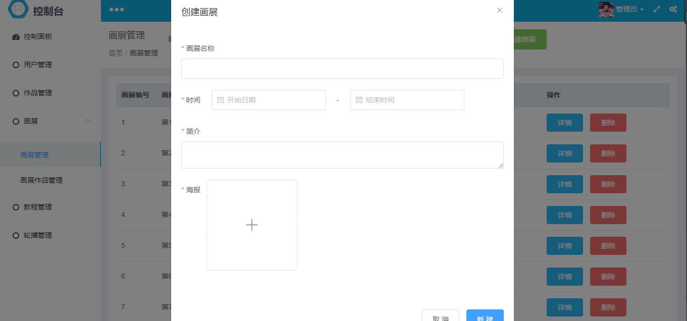

# art-admin
少儿美术馆Vue后台管理系统
## 项目说明
  后台管理系统是配合art-server的一套后台管理系统，也是自己空闲的时间写的，使用了ElementUI的界面库，主要就是一个图片上传和服务端的配合，
## 使用步骤
  * 复制项目
    git clone https://github.com/xikou1314/art-admin.git
  * 安装依赖
    npm install
  * 启动项目
    npm run dev
## 效果图
  
